# AWS S3 - Simple Storage Service

## Table of Contents
1. [Project Overview](#project-overview)  
    1.1 [Project Goals](#project-goals)  
    1.2 [Use Case](#use-case)  
2. [Project Tasks](#project-tasks)  
    2.1 [Create Bucket](#21-create-bucket)  
    2.2 [Upload a File](#22-upload-a-file)  
    2.3 [Enable Versioning](#23-enable-versioning)  
    2.4 [Set Permissions](#24-set-permissions)  
    2.5 [Create Lifecycle Policies](#25-create-lifecycle-policies)  
3. [Troubleshooting](#troubleshooting)  
4. [Conclusion](#conclusion)  

## Project Overview

This mini project focuses on utilizing Amazon S3 (Simple Storage Service) to create and manage buckets for efficient data storage. It covers core operations such as enabling versioning, applying lifecycle policies, setting public access permissions, and using bucket policies to secure data.

### Project Goals

- Gain hands-on experience with Amazon S3’s key features.
- Learn to create and configure S3 buckets.
- Manage objects, implement security controls, and configure versioning.
- Explore lifecycle rules for automated data management.

### Use Case

This project demonstrates how S3 can be used to securely store, manage, and retrieve data while maintaining scalability and durability.

## Project Tasks

### 2.1 Create Bucket

1. Navigate to the AWS Console and search for “S3”.  
   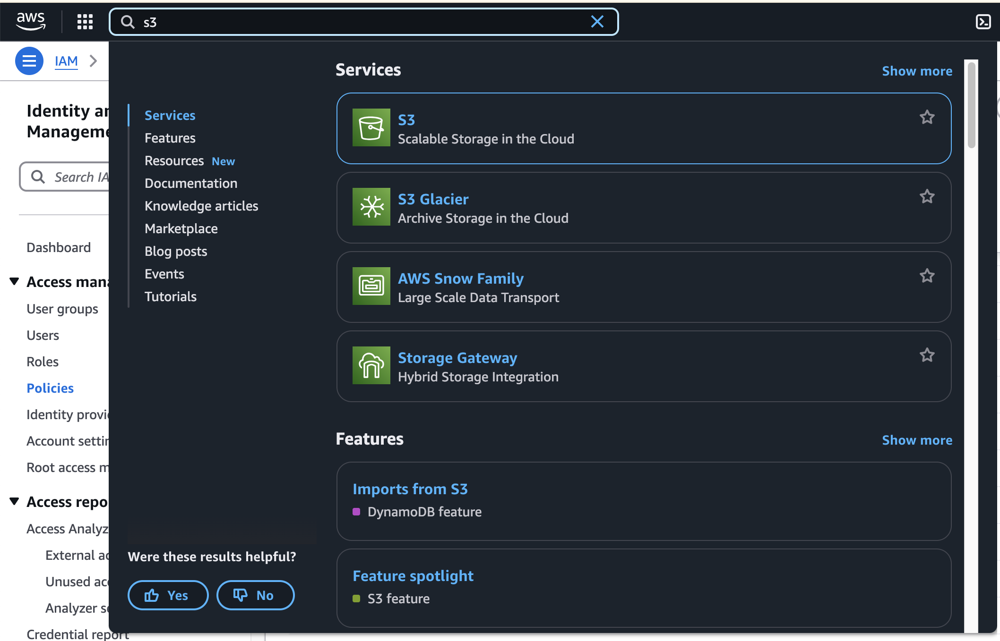

2. Click “Create Bucket”.  
   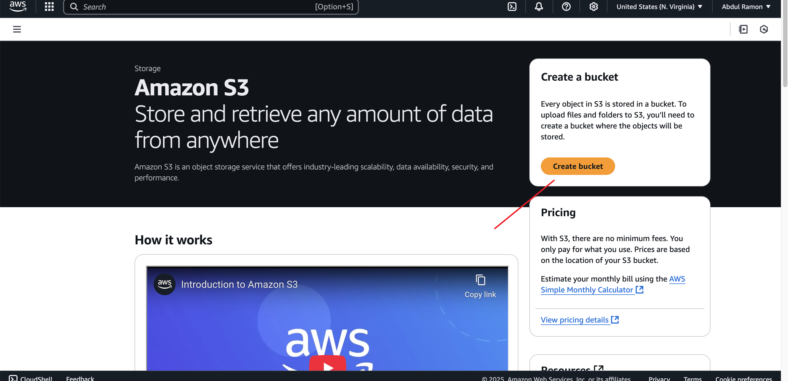

3. Enter a unique bucket name.  
   - Select “ACL Disabled” for object ownership.  
   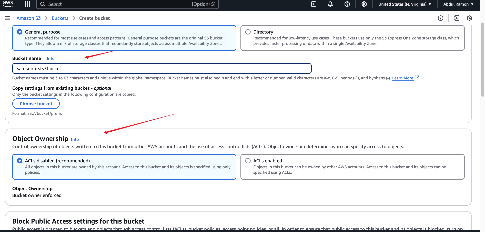

4. Enable “Block all public access” and leave versioning disabled.  
   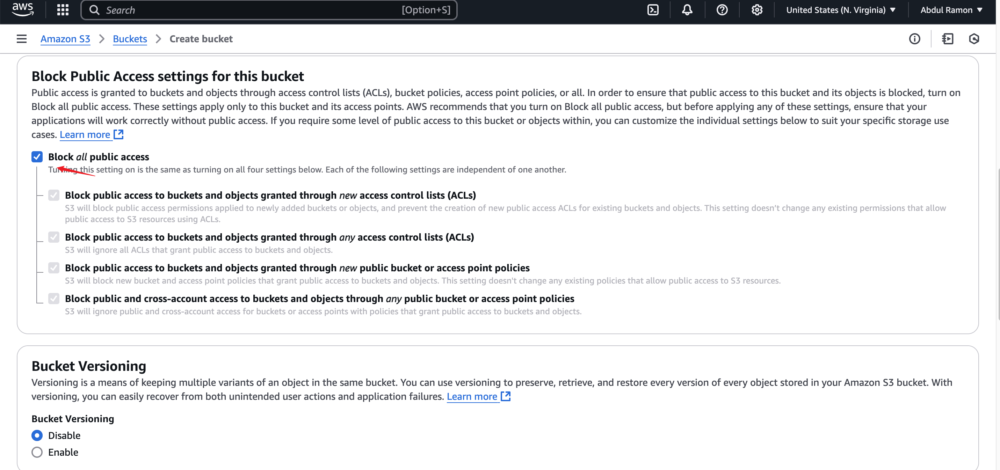  
   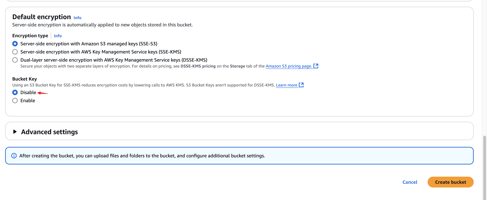

5. Click “Create bucket”.  
   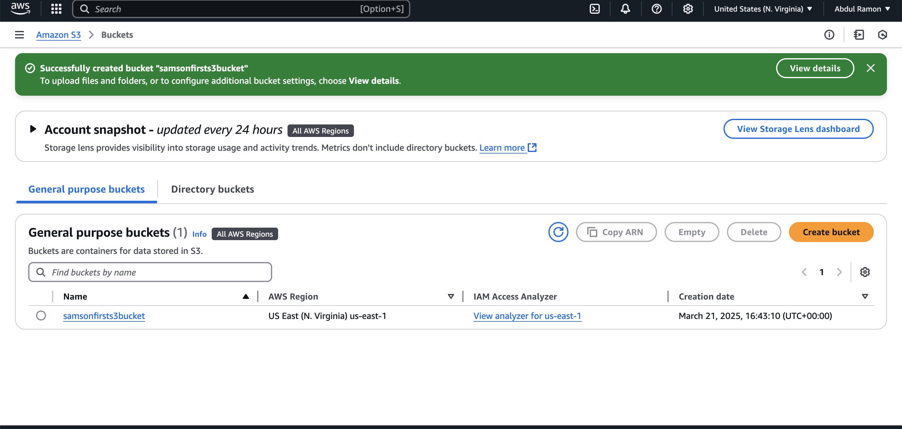

### 2.2 Upload a File

1. Create a file locally containing the text “Welcome to the AWS World”.  
   

2. In the S3 bucket, click “Upload”.  
   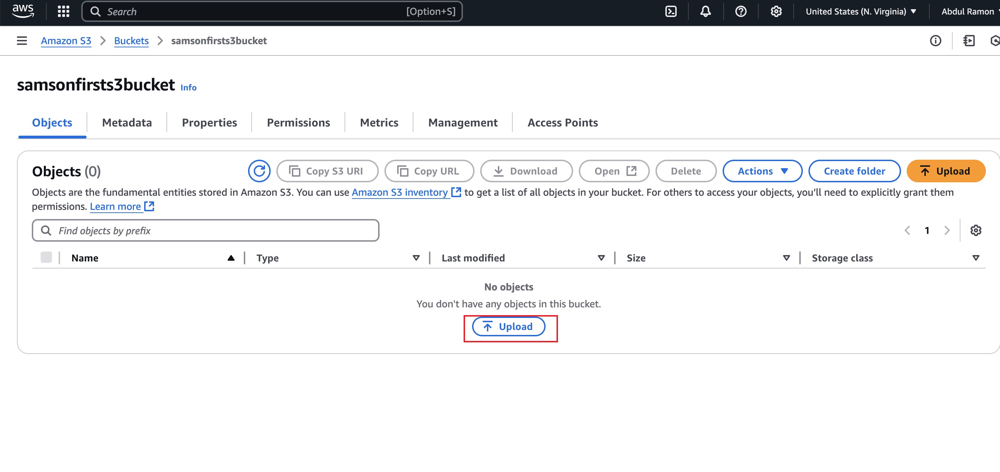

3. Click “Add file”, select your file, and click “Upload”.  
   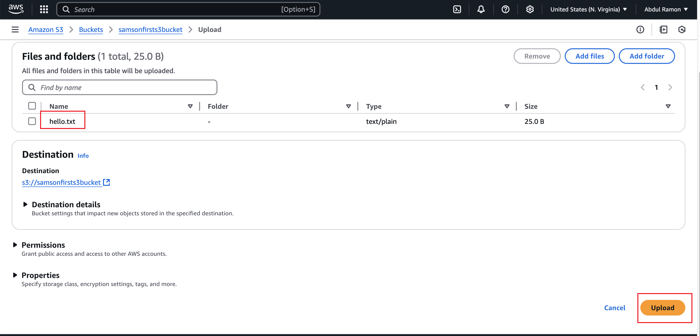  
   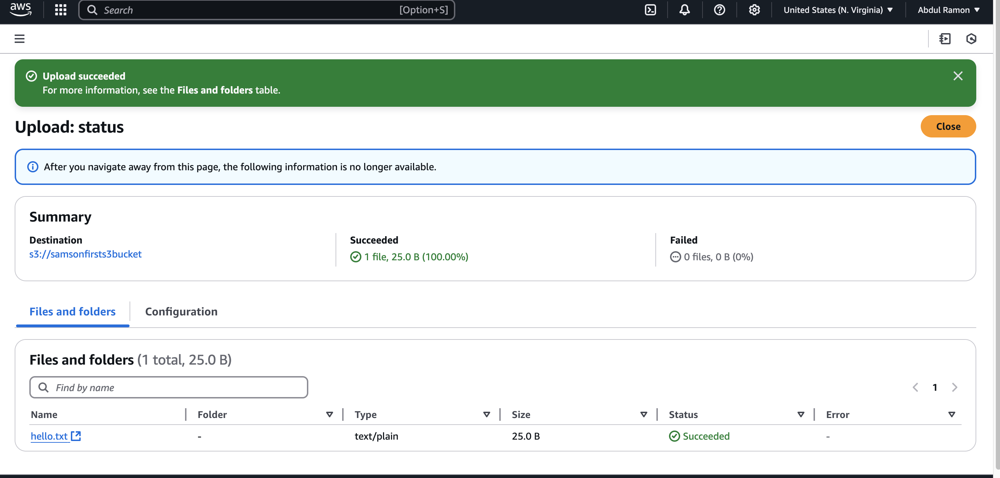

### 2.3 Enable Versioning

1. In the bucket’s “Properties” tab, click “Edit” next to versioning. Enable and save changes.  
   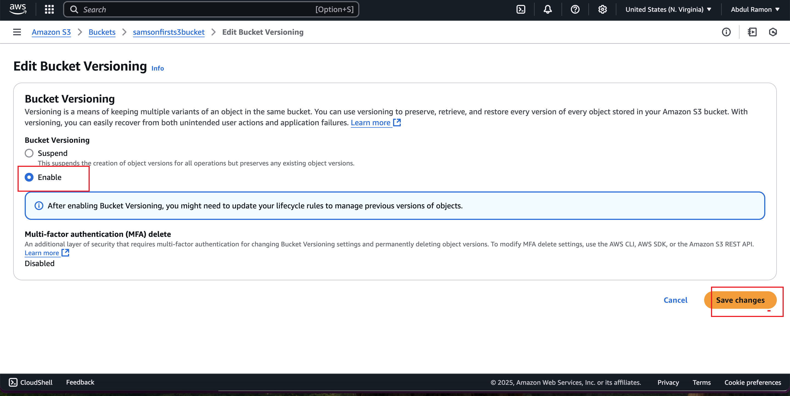

2. Modify the file and upload the new version.

3. Click “Show versions” to view file history.  
   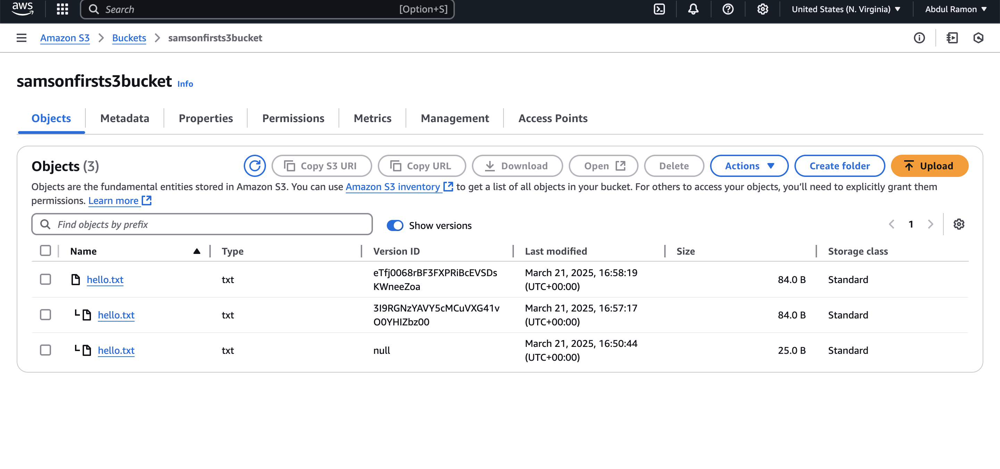

### 2.4 Set Permissions

1. In “Permissions”, uncheck “Block all public access” and save changes.  
   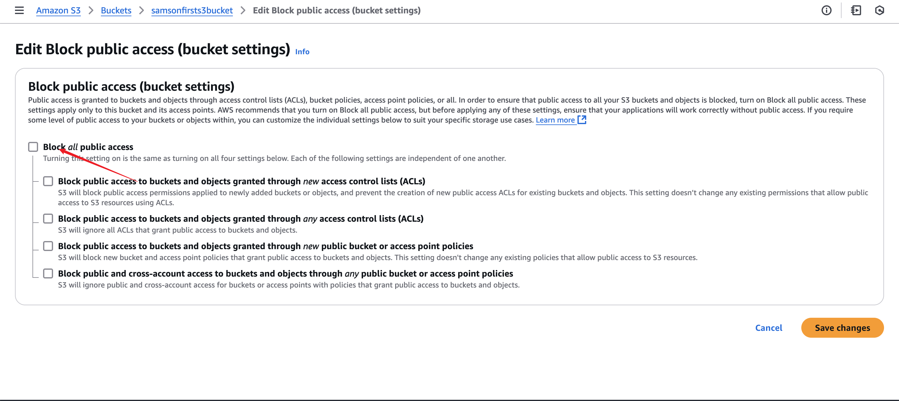  
   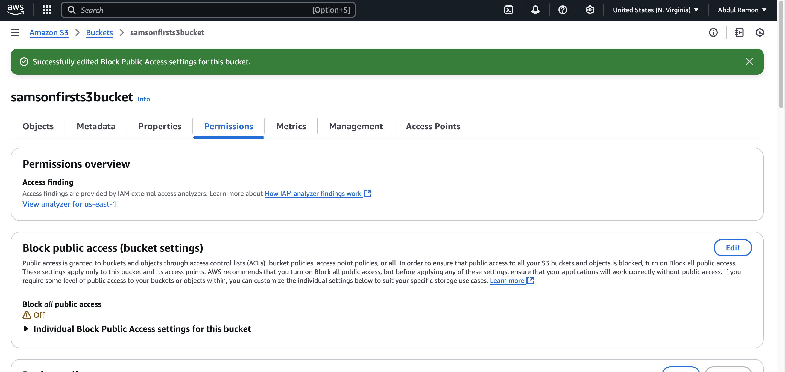

2. Click “Edit” under Bucket Policy and open the Policy Generator.  
   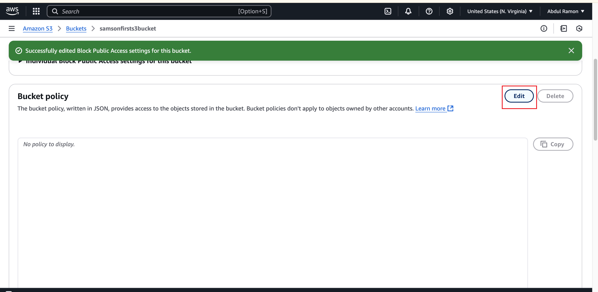

3. Fill in the policy details:  
   - Type: S3 Bucket Policy  
   - Effect: Allow  
   - Principal: *  
   - Actions: GetObject, GetObjectVersion  
   - ARN: your-bucket-arn/*  
   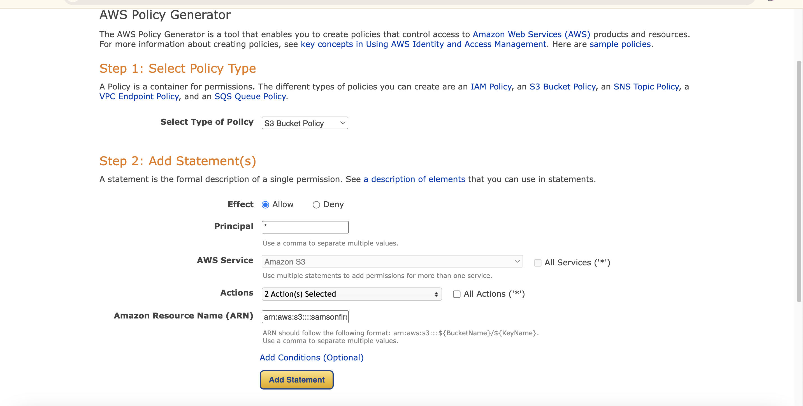

4. Click “Add Statement”, then “Generate Policy”.

5. Copy the generated policy, close the generator, and paste the policy in the Bucket Policy editor. Save changes.  
   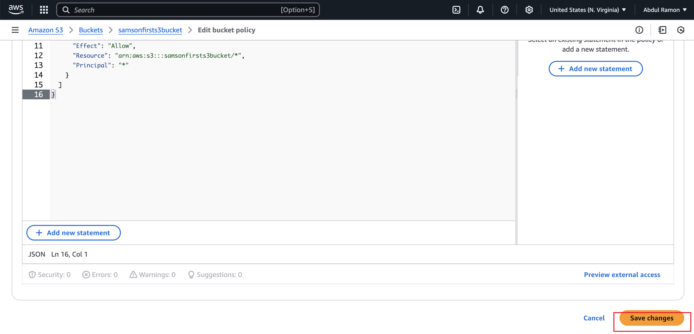

6. Access the object URLs from both versions of the file.  
     
   

### 2.5 Create Lifecycle Policies

1. Navigate to the “Management” tab and click “Add lifecycle rule”.  
   

2. Configure rule criteria and click “Create rule”.  
   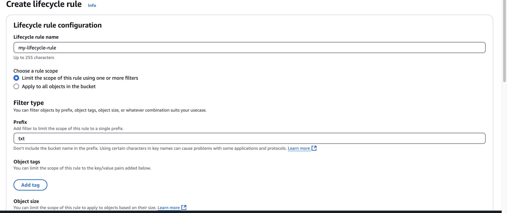  
   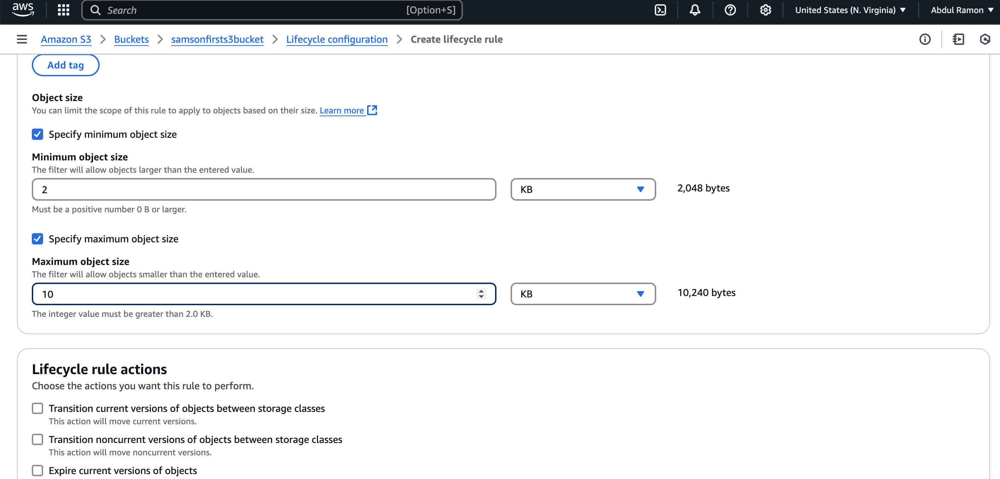  
   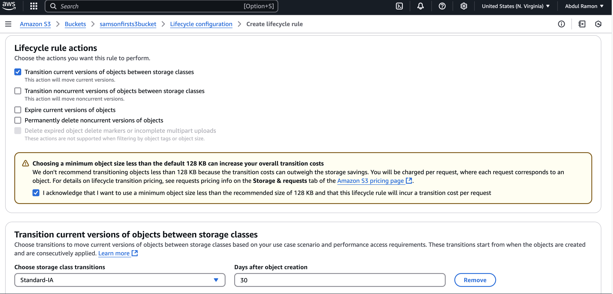  
   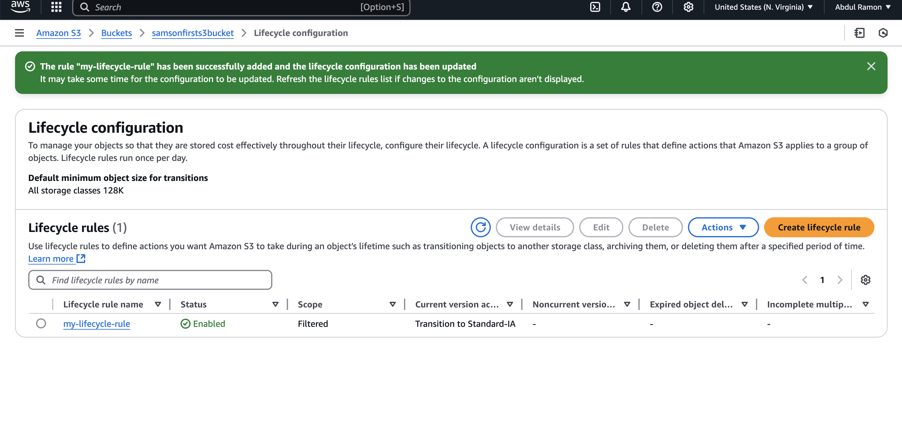

## Troubleshooting

- If the bucket creation fails due to name conflict, modify the name and retry.
- Refer to the official documentation for bucket naming rules:  
  [AWS S3 Bucket Naming Rules](https://docs.aws.amazon.com/AmazonS3/latest/userguide/bucketnamingrules.html)

## Conclusion

This project demonstrates the core functionalities of AWS S3 including bucket creation, object uploads, version control, lifecycle automation, and access control. These features enable scalable and secure data management on the cloud.
