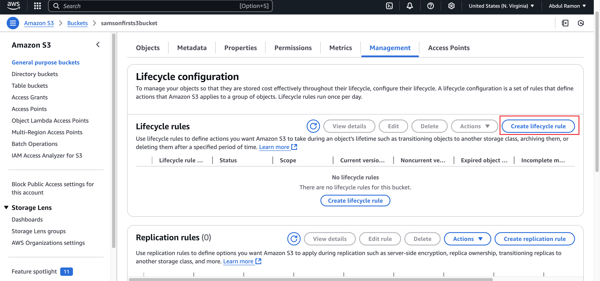

# Mini Project - AWS S3
## Mini Project - AWS Solution Architect

### 1. Project Overview
In this project i will be creating and managing S3 buckets for efficient data storage. I will implement security measures, such as bucket policies and access control lists, to protect data. I will also explore versioning, lifecycle policies and replication to enhance data management.

#### 1.1. Project Goals

* The primary goal of this project is to be familiarized with Amazon S3 (Simple Storage Service) and its fundamental concepts.
* Learn how to create and manage S3 buckets, upload objects, enable versioning, set permissions for public access, and implement lifecycle policies.

#### 1.2. Use Case
It helps be creating and managing S3 buckets for efficient data storage.

### 2. Project Tasks

#### 2.1. Part 1 (Create Bucket)

1. I navigated to the AWS Management Console and used the search bar to locate "S3".

2. From there, i located and clicked on the "Create Bucket" button.
 
3. I provided the name for the bucket
   * Selected "ACL Disabled" for object ownership.

   * I checked the "Block all public access" option and left Bucket Versioning disabled and proceeded with the default settings.

   * Then i clicked on "Create bucket" button.

  
#### 2.2. Part 2 (Upload a File)

1. I created a file on my laptop with the data "Welcome to the AWS World" and saved the file.

2. I clicked on the "Upload" button.

3. Then i clicked on "Add file" and selected the file i created. I then clicked "Upload" to complete the process.

#### 2.3. Part 3 (Enable Versioning)

1. In the bucket properties section, i clicked on "Edit" and selected "Enable".Then clicked on "Save changes" to enable versioning.

2. I then modified the content of the file and uploaded it again to create a new version of the file.
   
3. I clicked on "Show versions", to see all  versions of the file i uploaded.

#### 2.4. Part 4 (Setting Permissions)

1. In the permissions section of the bucket, i unchecked the "Block all public access" option, and clicked on "Save changes".

2. I then clicked on "Edit" and clicked on the "Policy generator".

3. I selected the "Type of Policy" as "S3 Bucket Policy"
   * Set the "Effect" to "Allow"
   * Specify the "Principal" as "*" which means all users
   * Chose the action "Get object" and "Get object version".
   * In the field of Amazon Resources Name (ARN) i typed the ARN of my bucket and added "/*" after the ARN.
   * Then clicked on "Add statement".

4. Then i clicked on "generate policy", copied the policy generated and clicked on "Close".
5. I navigated to the bucket policy tab and pasted the policy i created using the Policy Generator, then I clicked on "Save changes".

6. I then clicked on the first version of the file i created and clicked on the object URL.

7. I also clicked on the later version of the same file and clicked on the object URL.

#### 2.5. Part 5 (Creating Lifecycle Policies)

1. I navigated to the management section of the bucket and clicked on "Add lifecycle rule".

2. I gave the specifications, and clicked "Create rule"

#### Troubleshooting
If you encounter an error message while creating your bucket, change the name and proceed again.
For further details on naming conventions, please refer to the documentation [Bucket naming rules](https://docs.aws.amazon.com/AmazonS3/latest/userguide/bucketnamingrules.html)

### Conclusion
I created and managed S3 buckets for efficient data storage. I also implemented security measures, such as bucket policies and access control lists, to protect data and explored versioning, lifecycle policies and replication to enhance data management.